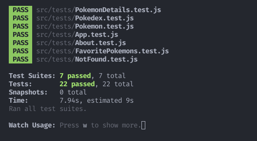

<h1 align="center">Project React Tests</h1>

<p align="center"> ✅ Concluded</p>

## 💻 Instalando o projeto

Clone o repositório:

```
git clone git@github.com:lramos33/project-react-tests.git
```

Acesse a pasta do repositório

```
cd project-react-tests
```

Instale as dependências:
```
npm install
```

Execute a aplicação
```
npm start
```

Execute os testes
```
npm test
```

## 🚀 Habilidades

- Utilizar os seletores (queries) da React-Testing-Library em testes automatizados;
- Simular eventos com a React-Testing-Library em testes automatizados;
- Testar fluxos lógicos assíncronos com a React-Testing-Library;
- Escrever testes que permitam a refatoração da estrutura dos componentes da aplicação sem necessidade de serem alterados;
- Criar mocks de APIs utilizando fetch;
- Testar inputs.


## 🔧 Desenvolvimento

Esse projeto contém uma aplicação React criada e configurada, e nele foram utilizados Jest e a biblioteca React Testing Library para escrever os testes.



## 📝 Requisitos do projeto

- [x] 1. Teste o componente `<App.js />`;

- [x] 2. Teste o componente `<About.js />`;

- [x] 3. Teste o componente `<FavoritePokemons.js />`;

- [x] 4. Teste o componente `<NotFound.js />`;

- [x] 5. Teste o componente `<Pokedex.js />`;

- [x] 6. Teste o componente `<Pokemon.js />`;

- [x] 7. Teste o componente `<PokemonDetails.js />`.

##

<div align="center">
  
  
  
</div>
